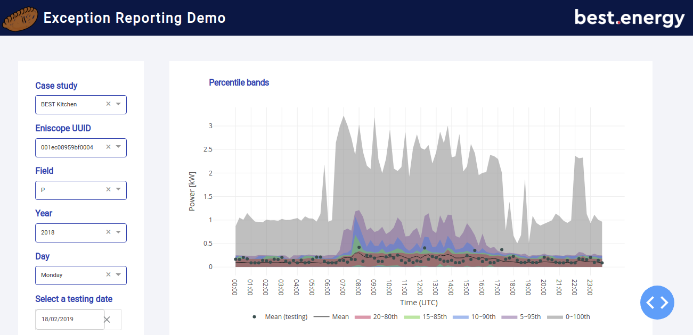

# Exception Reporting System

## About this app

This web-based app is designed to interactively display energy consumption data and spot anomalous energy consumption.

## How to run this app

To run this app first clone repository and then open a terminal to the app folder.

```
git clone https://github.com/zeliangwang/ExRepDemo.git
cd ExRepDemo
```

Create and activate a new virtual environment (recommended) by running
the following:

On Linux or macOS

```bash
conda create --name dash-env python=3.6
conda activate dash-env
```

Install the requirements:

```
pip install -r requirements.txt
```
Run the app:

```
python app.py
```
You can run the app on your browser at http://127.0.0.1:8050


## Screenshots


